<!-- TOC depthFrom:1 depthTo:6 withLinks:1 updateOnSave:1 orderedList:0 -->

- [第1章-面试的流程](#第1章-面试的流程)
	- [面试套路](#面试套路)
		- [面试三种形式](#面试三种形式)
			- [电话面试](#电话面试)
			- [共享桌面远程面试](#共享桌面远程面试)
			- [现场面试](#现场面试)
		- [面试三个环节](#面试三个环节)
			- [行为面试](#行为面试)
				- [区分了解+熟悉+精通](#区分了解熟悉精通)
			- [技术面试](#技术面试)
				- [基本功](#基本功)
			- [应聘狗提问环节](#应聘狗提问环节)
	- [END](#end)

<!-- /TOC -->

# 第1章-面试的流程

## 面试套路

* 简历扫选只是第一步，之后还有电话面试、共享桌面远程面试、现场面试
* 初级程序员看算法和数据结构，高级程序员看项目经验
* **不要不懂装懂，答非所问 - 大忌**，不确定面试官问题一定要问清，直到弄懂面试官的意图再作答。
* 面试官需要写面试报告的哦，所以一般会在一定时间一刻，半小时时间，问你足够多的问题，如果你答的少就问得多，答得多就问的少，这很有可能哦~谁都不想自己被走过场似得问一堆问题然后不了了之，也不跟你说答得对不对，问的问题也没啥思路，这种多半很尴尬，凑时间问完拜拜~

### 面试三种形式

* 各公司都有一套面试流程，**当然简历扫选就被淘汰了后面没玩头，所以简历一定要特么的认真写~**
* 然后再谈面试，简历--->面试。无简历不面试

#### 电话面试

* 投简历过后一两周内要时刻保持手机能够通话一两个小时，夜间凌晨什么的没有哪个智障公司会给你打电话，放心~

#### 共享桌面远程面试

* 也不是很多公司有这个环节，其实就是要看你代码调试能力，编写代码速度。其实这多数在现场面试考核，可能没有条件现场面试就会酱紫

#### 现场面试

* 心态好，皮厚，妥妥的。就算不会也是一脸吊里吊气
* IT屌丝男无需正装，干净舒服出场就行

### 面试三个环节

#### 行为面试

* 暖场过程，自我介绍，工作经历，学习经历 30S到1分钟。面试官手头有你的简历，基本废话少说
* 目的：了解你性格，是否反人类，反社会。心态如何，别吓尿了
* 行为面试还包括项目，当然，项目就是你过往的行为~，没毛病
* 项目介绍按这个过程来，**大家都很忙，按套路出牌谁也不懵逼**

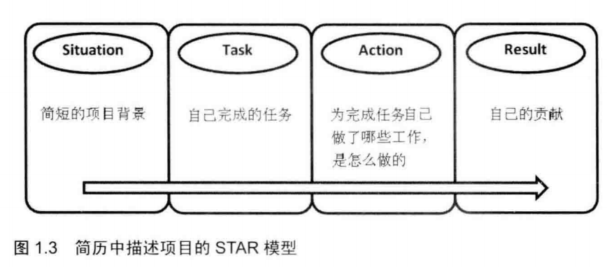

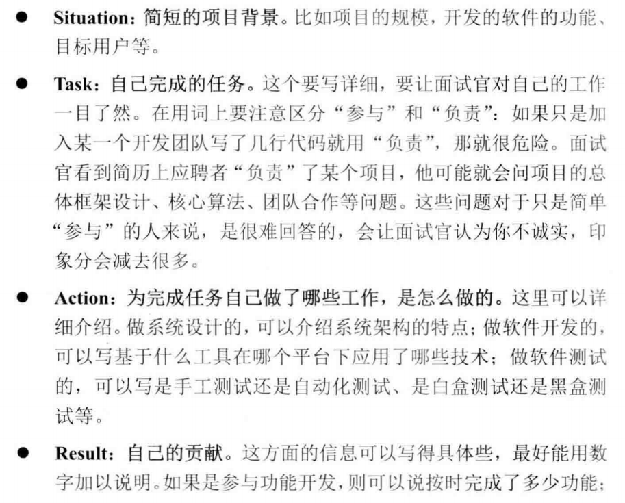

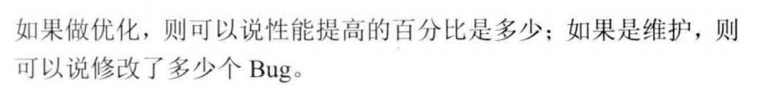

* 这个套路再详细不过了。可能某些智障面试官会反套路？听多了面试者的套话估摸会酱紫
* 项目扯完，面试官基本就这些问题

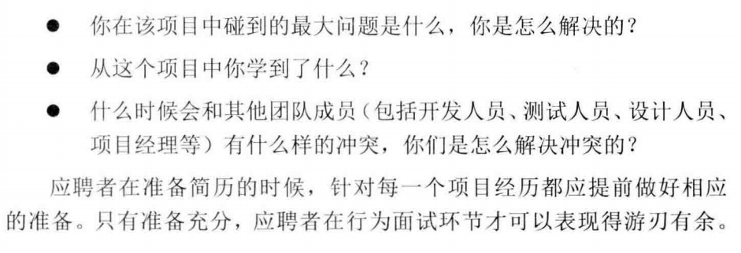

* 项目可以瞎掰，没毛病，你牛逼到可以不用做项目就能把项目吃透，那也是种能力。PS:Big old，god bless you~
* 也可能你自己做的项目但是了解不够透彻，这时候被问懵逼也没什么，老实交代自己没尝试从哪方面去想什么的也可以
* 项目介绍突出自己的工作，毕竟是你面试，面试就是把自己端出来求收留~
* 吊里吊气的叔叔阿姨，你们不适合面试，自己开公司去吧
* 还记得研究生面试的时候，某某学生口气很吊，“鉴于我的优秀，愿意与你合作”。。这人咋不上天嘞？
* 态度诚恳，必要装怂不可少。诚实守信八荣八耻记牢喽。

##### 区分了解+熟悉+精通

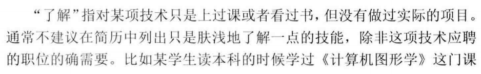

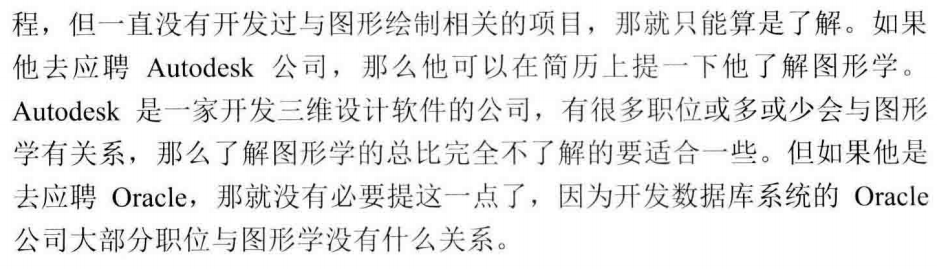

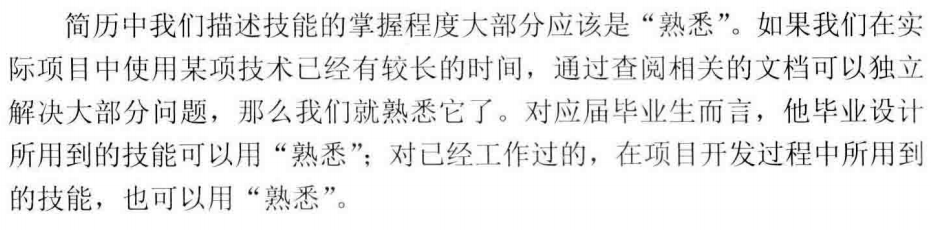

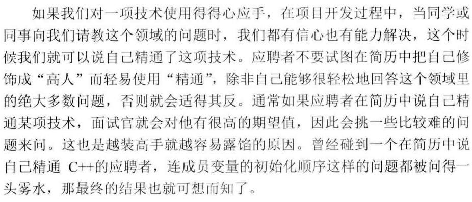

* 装逼遭雷劈，从头劈到小鸡鸡~
* 量力而行，好自为之~

#### 技术面试

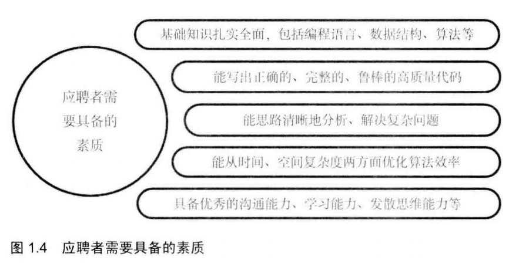

* 技术面试占绝大部分时间，面试官会尽可能虐死你。这是重头戏环节~
* 关注5大素质：
  - 扎实的专业基础
  - 高质量代码编写
  - 分析问题思辨能力
  - 优化时间空间效率
  - 学习沟通能力
* 面试之前要拼命复习or预习，掌握**编程语言、数据结构、算法**等基础知识
* **鲁棒**是Robust的音译，也就是健壮和强壮的意思。它是在异常和危险情况下系统生存的关键。比如说，计算机软件在输入错误、磁盘故障、网络过载或有意攻击情况下，能否不死机、不崩溃，就是该软件的鲁棒性。所谓“鲁棒性”，是指控制系统在一定（结构，大小）的参数摄动下，维持其它某些性能的特性。根据对性能的不同定义，可分为稳定鲁棒性和性能鲁棒性。以闭环系统的鲁棒性作为目标设计得到的固定控制器称为鲁棒控制器。
* 如果问题之间有关联，回答也尽可能关联起来答，根据之前特性，怎么滴怎么滴。这种学习方式叫啥来着，举一反三？类比？

##### 基本功

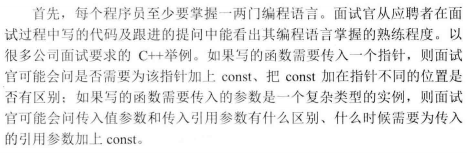

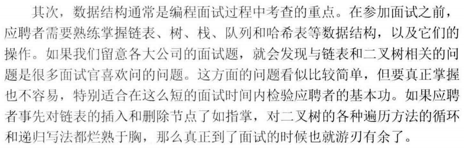

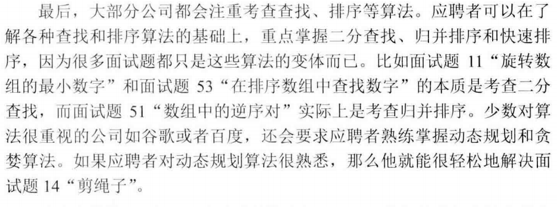

* 如何鉴定代码鲁棒？面试官会用临界条件、特殊输入输出调戏你~其实代码的健壮性就是代码是否考虑到了足够多的问题，很多特殊状态没考虑就容易JJ
* 面试官喜欢用简单问题调戏你哟，你特么的要是一听题目简单就嘚瑟，99.99%就唧唧复唧唧了~

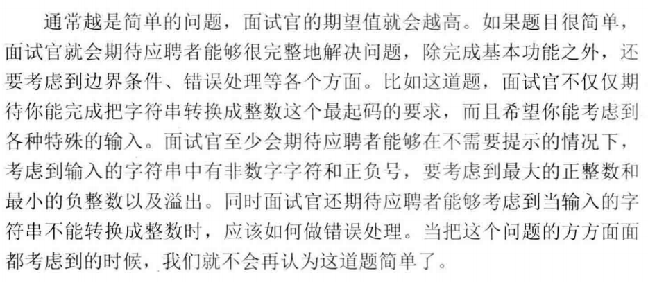

* 面试官不能容忍的就是程序的鲁棒性。智障代码没有考虑周全，不知道判断参数正确性直接执行核心代码妥妥鸡鸡~
* C语言里面很神奇的goto语句，妥善用。但是不排除面试官菜鸡不会用一看goto让你鸡鸡也不是不可能。毕竟谁也不知道谁水平如何，万一你超神了嘞，虽然这是小概率事件。
* 写完代码之后，不要急着给面试官看，你的脑子就是个运行环境，跑一跑。急锤子急，鉴于你太嘚瑟，下一道题让你懵逼。哦对，也可能没有下一题。
* **软技能**，其实就是团队合作的能力，这年头一个大型软件绝不可能一个人搞定，多是很多大佬协作。
* **丑数**，首先除2，直到不能整除为止，然后除5到不能整除为止，然后除3直到不能整除为止。最终判断剩余的数字是否为1，如果是1则为丑数，否则不是丑数。
* 面试官可能对你的方向表示怀疑，你对这个行业有多了解基本可以判断。
* 面试官会考察：软技能、学习能力、知识迁移能力、抽象建模能力、发散思维能力

#### 应聘狗提问环节

* 面试官让你提问，要考验你对该公司，该部门是否感兴趣~所以，也别瞎扯淡问。如果你都不感兴趣，还来干锤子~
* 去之前了解一下该公司，想想该问啥？至少准备一两个问题，如果，一个问题不问就走了，不怼一下不四男子汉~
* 不要问薪水
* 不要立即问面试结果，因为问也白问，都是全都面完优胜劣汰

## END
